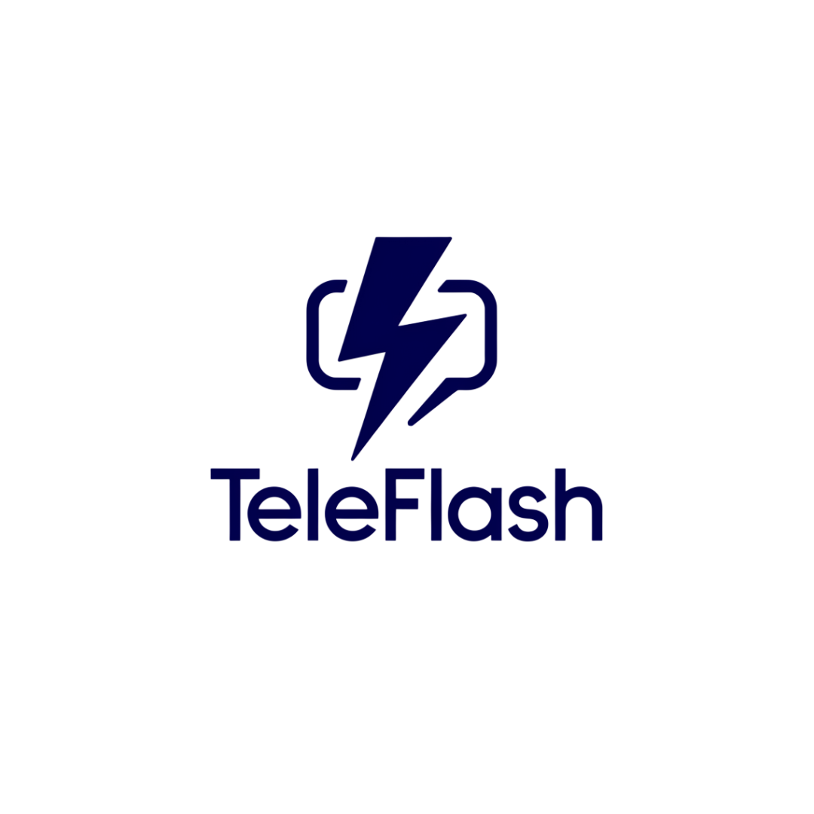

# TeleFlash: AI-Powered Telegram Analytics for Finnish Content

TeleFlash delivers automated 8-hour summaries of Finland-related discussions from Russian and Ukrainian Telegram channels directly to Slack.

## How It Works

* **AI-Powered Summaries**: Every 8 hours, our tool analyzes and summarises Telegram posts about Finland and Finnish people made by Ukrainian and Russian channels
* **Source Tracking**: All summaries include links to original messages
* **Slack Integration**: Reports are posted to #daily-summaries-tg channel in our TeleFlash workspace

## Connect to TeleFlash

[Join TeleFlash Workspace](https://join.slack.com/t/teleflash/shared_invite/your-invite-link-here)
